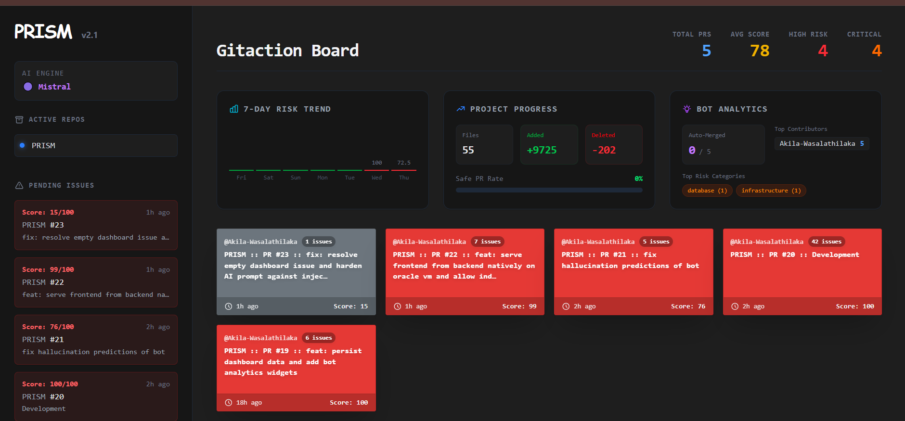

# PRISM 🛡️

**Pull Request Risk & Intelligence System**

PRISM is a self-hostable GitHub App that automatically analyzes pull requests for security vulnerabilities, destructive database migrations, hardcoded secrets, and codebase impact. It acts as an autonomous reviewer and gatekeeper.

**Live Demo Dashboard**: [http://161.118.189.191:8000/dashboard](http://161.118.189.191:8000/dashboard)



## Features

- **Multi-Provider AI Analysis**: Bring your own AI! Supports Mistral, OpenAI, Google Gemini, Anthropic, Ollama (local/free), or any custom OpenAI-compatible endpoint.
- **Deterministic Risk Engine**: Hardcoded pattern matching for critical security risks (e.g. AWS Keys, `DROP TABLE`).
- **Dashboard**: Real-time project progress, risk trends, and bot analytics.
- **Auto-Merge**: Safely merges 0-risk PRs with low blast radius automatically.
- **Security Hardened**: Rate limited, webhook signature validation, caching, and payload protection.

## Self-Hosting Guide

Deploying PRISM is easy with Docker Compose.

### 1. Requirements
- Docker & Docker Compose
- A GitHub App (see below)

### 2. Setup

Use the interactive setup script to generate your `.env` configuration:

```bash
python setup.py
```

The script will guide you through:
1. Entering your GitHub App credentials
2. Choosing your AI provider (e.g., Gemini, Mistral, OpenAI, Ollama) and entering the API key

### 3. Run

Once your `.env` file is generated, start the entire stack:

```bash
docker compose up -d
```

Your PRISM backend will be running on `http://localhost:8000` and the Postgres/Redis services will automatically start.

### 4. Deploying to the Cloud

You can easily deploy PRISM to cloud providers like Oracle Cloud, AWS, or DigitalOcean:

1. Spin up an Ubuntu VM on your preferred cloud provider.
2. Install Docker and Docker Compose on the VM.
3. Clone this repository to the VM.
4. Run `python setup.py` and `docker compose up -d` just like in the local setup.
5. Update your GitHub App Webhook URL to point to your cloud instance's IP or domain (e.g., `http://<your-cloud-ip>:8000/api/webhooks/github`).

---

## Setting up the GitHub App

1. Go to your GitHub account/organization settings -> **Developer Settings** -> **GitHub Apps**
2. Click **New GitHub App**
3. **Webhook URL**: `http://<your-server-ip>:8000/api/webhooks/github` (Use ngrok for local testing)
4. **Permissions**:
   - `Pull Requests`: Read & Write
   - `Checks`: Read & Write
   - `Contents`: Read-only
5. **Events**: Check `Pull request`
6. Generate a private key and save the `.pem` file.

---

## AI Providers

PRISM will auto-detect the provider based on which API key is present in your `.env` file (configured via `setup.py`). 

- **Mistral**: Free tier available at `console.mistral.ai`
- **Gemini**: Free tier available at `aistudio.google.com`
- **OpenAI**: Requires paid account at `platform.openai.com`
- **Anthropic**: Requires paid account at `console.anthropic.com`
- **Ollama**: Completely free and runs locally (`ollama.com`)

If no AI provider is configured, PRISM will gracefully fall back to **Deterministic Only** mode, running regex-based pattern matching without external API calls.

## Development

```bash
cd backend
pip install -e ".[dev]"
pytest
ruff check .
```
